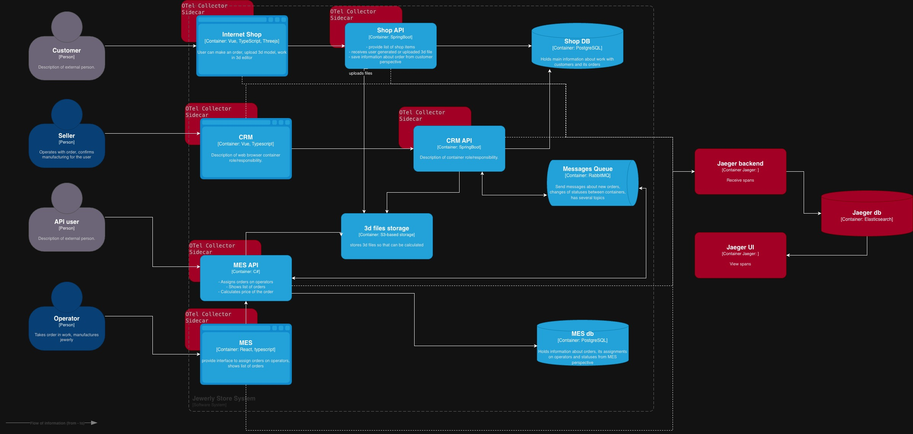

# Задание 3. Трейсинг

В процессе продвижения по своему жизненному циклу, заказ может застрять в ряде мест:

- Internet shop, а в частности Shop API, так как в этом месте идет взаимодействие с несколькими хранилищами,
  значит могут быть задержки по времени, таймауты и тд.
- При работе с CRM. CRM API передает сообщение в очередь. Если был какой-то сбой, то сообщение может и не дойти до MES
  API,
  что приведет к "зависанию" заказа
- MES API передает заказ в MES, далее начинается длительный процесс вычислений. В этом месте заказ также может "
  застрять".
  Поэтому это место требует дополнительного мониторинга

Для анализа проблем, необходимо обеспечить передачу в систему трейсинга:

- сквозного идентификатора trece_id, а также организовать его передачу между всеми сервисами и очередями,
- ендпоинты, топики очереди, в которые передаются данные
- ИД заказа, пользователя или другой уникальный бизнес ИД.
- другие, важные для вызова конкретных сервисов данные

## Мотивация

Трейсинг помогает быстро находить причины, например, медленной работы сервиса.
Вместо просмотра всей цепочки вызовов, которую нужно к тому же раскрутить, разработчик может посмотреть, сколько,
где и с какими параметрами прошёл вызов. У трейсинга как средства устранения неполадок есть дополнительные преимущества,
поскольку любое исключение или ошибка обычно фиксируется вместе со всем контекстом запроса.

Внедрение системы трейсинга, позволит сосредоточиться и исправить узкие и критические места,
где сосредоточено наибольшее количество ошибок и задержек, а это в свою очередь приведет к:

- сокращению времени реакции на инциденты, а также на анализ и исправление инцидентов,
- сокращению латентности
- увеличение удовлетворенности клиентов

## Предлагаемое решение

Для внедрения трейсинга, необходимо обеспечить передачу данных.
Для это в каждый сервис необходимо внедрить OpenTelemetry sdk, чтобы передавать данные контекста для трейсинга.
Для минимизации изменений в коде приложений, добавим OpenTelemetry sdk, чтобы генерировать необходимую информацию,
а для отправки в систему агрегации будем использовать сайдкары otel-collector.
Так как в системе присутствует брокер очередей, то приложения, которые взаимодействуют с брокерами, все равно нужно будет доработать, 
чтобы обеспечить передачу в очередь параметров трейсинга.
В качетве хранилища развернем Elasticsearch. Она же, или другой инстанс может использовать для системы мониторинга.
В качестве системы сбора и отображения будет использовать Jaeger. Jaeger — удобный инструмент и для визуализации
трассировок в распределённых системах. Jaeger-UI — веб-интерфейс для поиска и просмотров трейсов.

## Компромиссы

Трейсинг это еще одна система, требующая времени и компетенций не только от разработки, 
но и, в первую очередь, от группы сопровождения и DevOps инженеров.
В случае ресурсных ограничений, может понадобится дорабатывать каждой приложение сервис отдельно для сбора и передачи
спанов в систему трейсинга, а при наличии больший монолитных сервисов, это может знаять значительное количество времени.

В таком случае, если приложение уже подключено к системам мониторинга и централизованного логирования, значит
уже есть вся необходимая информация для анализа инцедентов и проблемных мест, трейсинг только поможет ускорить решение приблем.

Также, можно ограничиться только подключением в сервисы библиотек вида OpenTelemetry sdk или Brave(sleuth), 
что обеспечить передачу дополнительных технических данных, таких как trace_id в систему логирования. 
Далее инженер уже вручную сможет отыскать необходимы сообщения, связанные с обработкой конкретного заказа.

## Меры безопасности

Для обеспечения безопасности системы трейсинга необходимо обеспечить следующее:
- Шифрование при передаче данных: TLS/mTLS
- Аутентификация: API tokens, OAuth2
- Авторизация: RBAC
- Аудит доступа к данным трейсинга