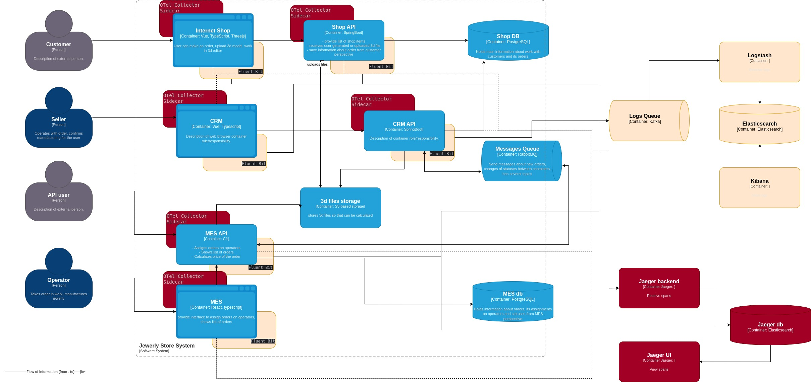

# Задание 4. Логирование

Так как сейчас все проблемы решаются только со слов клиента, то для выявления проблемых мест необходимо:

1. Добавить уровень INFO для всех сервисов и всех методов API, о начале выполнения процесса и успешном завершении процесса.
Также необходимо добавить блок MDC, куда в начале обработки добавлять ИД заказа, ИД пользователя, название процесса.
Тогда каждый текст логов будет сопровождаться необходимой информацией для анализа.
2. Добавить логи уровня ERROR, если процесс завершился с ошибкой.
Для этого нужно, например, каждый процесс взять в блок try catch и принудительно логировать ошибки.
Также если в коде уже присутствуют какие-то блоки try catch внутри процессов обработки, 
то добавить в них логирование уровня WARN или ERROR, в зависимости от критичности реагирования на проблему.
3. Добавить логирование уровня INFO всех мест по взаимодействию с хранилищами для CRUD операций.
Можно залогировать начало и конец выполнения операций. В дальнейшем можно изменить их на уровень DEBUG.
Или же сразу сделать их DEBUG, но тогда придется повысить уровень логирования на ПРОМе, 
пока не будут устранены все критичные проблемы на соответствующих сервисах.
4. Таким же образом поступить с вызовом API внутри сервисов.
5. Добавить логирование добавления сообщений в брокер.
Обычно добавление происходит асинхронно, и добавляются 2 колбека, с уровнем INFO - в случае успеха, и ERROR - в случае ошибки.
6. Добавить логирование обработки сообщений из очереди консюмерами по аналогии с пунктом 1.

## Мотивация

Логирование, а особенно централизованную систему логирование необходимо внедрять так как:
1. Разработка ПО, как и любой процесс производства продукции, сопровождается сбоями и ошибками. 
Логирование позволит наиболее оперативно выявить проблемы и понять причину их возникновения.
2. Особенно логирование сильно поможет на первых этапах внедрения продукта и в период наиболее активных доработок.
Так как тестирование и тестовые данные, зачастую выявляют только часть проблем,
а проверить и предвидеть все возможные сценарии промышленной эксплуатации затратный и длительный процесс.
3. При наличии несколько сервисов, анализ проблем и решение инцедентов может занять длительное время, 
что скажется на доступности системы и на репутации компании. Поэтому необходимо централизованное место,
где будут агрегироваться логи со всех сервисов, для оперативного анализа.
4. Также логирование позволит отслеживать действия пользователей и выявлять подозрительную активность.

Метрики, на которые повлияет внедрение логирования:
1. Время решения инцидентов
2. Доступность системы
3. Частота развертываний, которые приводят к инцидентам

## Предлагаемое решение

В качестве системы логирования предлагается использование стека Elasticsearch.
1. Для хранения логов будм использовать Elasticsearch
2. Для отображения Kibana
3. Для передачи логов от приложения будем использовать Filebeat или Fluent Bit
4. Для обработки и сохранения в Elasticsearch - Logstash
5. Также, для повышения надежности, можно добавить Kafka в качестве транспорта, для доставки логов между Beats и Logstash

## Меры безопасности

Для обеспечения безопасности системы трейсинга необходимо обеспечить следующее:
- Шифрование при передаче данных: TLS/mTLS
- Аутентификация: API tokens, OAuth2
- Авторизация: RBAC
- Аудит доступа к данным трейсинга
- Чувствительные и конфиденциальные данные или исключить или маскировать при логировании.

##  Политика хранения

Для начала можно создать единый индекс на всю систему, так как, в целом, весь продукт занимается обработкой заказов
и необходимо отслеживать весь контекст выполнения операций.
Для оптимизации будем создавать и=отдельный индекс на каждый день и удалять индексы старше 7 дней. 
Этого времени вполне должно хватить для анализа как критичных, так и менее критичных проблем.

## Мероприятия для превращения системы сбора логов в систему анализа логов

Если система логирования введена недавно, то для начала можно создать отдельный дашборд,
на котором выводить все возникающие в системе ERROR, все одинаковые сообщения агрегировать 
и выводить на дашборд по количеству возникновения ошибки. 
Далее на ежедневной основе передавать список наиболее часто повторяющихся ошибок аналитике и команде разработки 
для выявления наиболее критичных и их исправления.

Также можно настроить алерты, и информировать инженеров сопровождения, если какие-то ошибки начинают возникать 
слишком часто, или количество ошибок превысило пороговое значение.

## Таблица сравнения технологий

| **Параметр**               | **ELK**              | **Loki**           | **ClickHouse**       | **Splunk**      |
|----------------------------|----------------------|--------------------|----------------------|-----------------|
| **Лицензия**               | AGPL 3 / SSPL / ELv2 | Apache 2.0 (OSS)   | Apache 2.0 (OSS)     | Проприетарная   |
| **Стоимость storage**      | средняя              | низкая             | низкая               | выше среднего   |
| **Полнотекстовый поиск**   | Отличный             | Нет                | Требует nGram индекс | Отличный (SPL)  |
| **Analytics queries**      | Хорошо               | Медленно           | Очень быстро         | Хорошо          |
| **Операционная сложность** | высокая              | низкая             | ниже среднего        | выше среднего   |
| **Время на внедрение**     | 4-6 недель           | 1-2 недели         | 3-4 недели           | 6-8 недель      |
| **Поддержка**              | Elastic Support      | Community          | Community            | Premium support |

